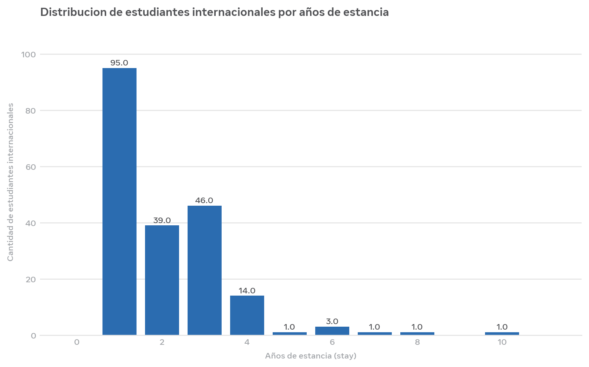
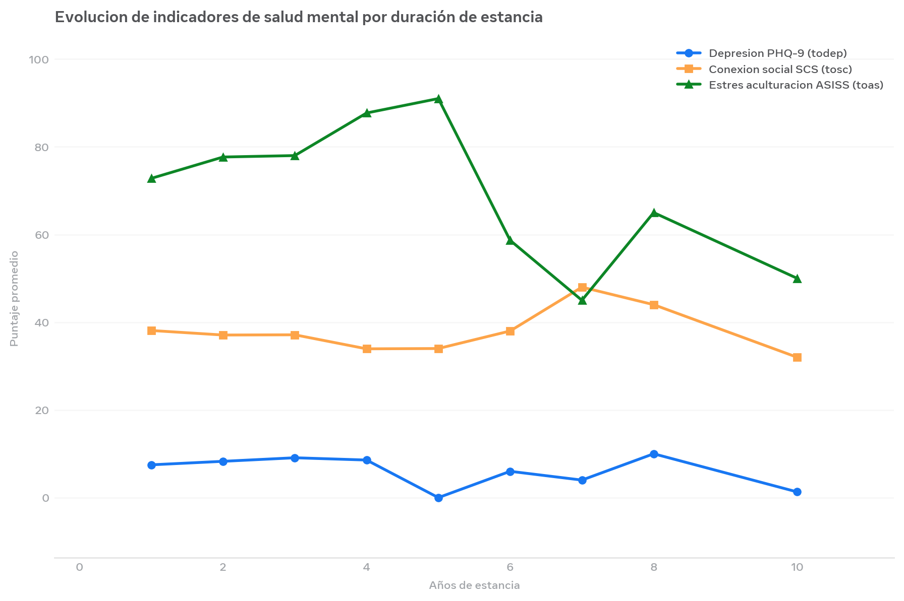

# Análisis de Salud Mental de Estudiantes Internacionales (Japón, 2018)


## Resumen del proyecto
Análisis exploratorio de 286 estudiantes de una universidad internacional japonesa (2018) para evaluar cómo la duración de la estancia (`stay`) impacta en la salud mental: depresión (PHQ-9), conexión social (SCS) y estrés de aculturación (ASISS).

> **Enfoque portfolio:** Se migró de la versión de DataCamp a un flujo reproducible con SQL + Python, sin capturas de consola.

## Dataset
- **Fuente:** Estudio universitario japonés (2018)
- **Registros:** 286 totales, 201 internacionales (`inter_dom = 'Inter'`)
- **Variables clave:** 
  - `stay`: años de estancia (1-10)
  - `todep`: puntaje depresión PHQ-9
  - `tosc`: puntaje conexión social SCS
  - `toas`: puntaje estrés aculturación ASISS

## Metodología
```sql
SELECT
  stay,
  COUNT(*) AS count_int,
  ROUND(AVG(todep), 2) AS average_phq,
  ROUND(AVG(tosc), 2) AS average_scs,
  ROUND(AVG(toas), 2) AS average_as
FROM students
WHERE inter_dom = 'Inter'
GROUP BY stay
ORDER BY stay DESC;
```

## Hallazgos principales
- **Distribución:** 95 estudiantes en año 1 vs 1 estudiante en año 10. Fuerte deserción / finalización.
- **Depresión PHQ-9:** Se mantiene entre 7.48 y 9.09 en estancias de 1-4 años (rango leve-moderado).
- **Conexión social SCS:** Estable entre 33-38 puntos, sin mejora significativa con los años.
- **Estrés aculturación ASISS:** Permanece alto (>72) y sube a 87.71 en año 4, indicando dificultad de integración sostenida.

Visualización:




## Stack
- SQL (WHERE, GROUP BY, AVG, ROUND)
- Python (Pandas, Matplotlib)
- Jupyter Notebook

## Estructura del repositorio
```
├── data/
│   └── students.csv
├── queries/
│   └── consultas_principales.sql
├── visuals/
│   ├── cover.jpg
│   ├── salud_mental_distribucion.png
│   └── salud_mental_evolucion.png
├── analisis_salud_mental.ipynb
└── README.md
```

## Autor
Enrique Talavera - [LinkedIn](https://www.linkedin.com/in/enrique-talavera-/) | [GitHub](https://github.com/enriquetalavera)

